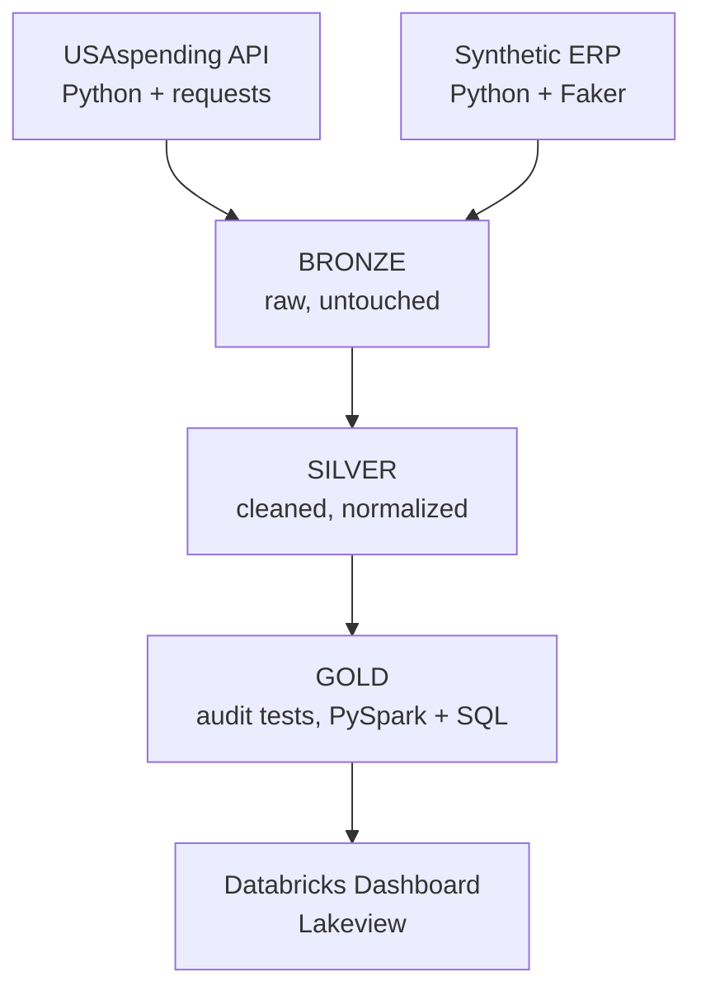

# Audit Analytics & Financial Transaction Risk Screening Platform

> **Built entirely on Databricks** using **PySpark, Python, SQL, Delta Lake, and Databricks Dashboards (Lakeview)**

## Overview

This project simulates the kind of data analytics work performed by an audit analytics team: taking a large transaction population, running systematic risk-screening tests, and surfacing findings that help prioritize where human auditors should focus their attention.

The project has two modules:
- **Module 1 (real data):** U.S. federal contract spending data from USAspending.gov, scoped to Department of Defense contract awards (FY2022–FY2024)
- **Module 2 (synthetic data):** A generated ERP-style dataset (Purchase Orders, Goods Receipts, Invoices, Journal Entries) — built specifically because real double-entry general ledger data is confidential and never publicly available

**Important framing:** every test in this project identifies **risk indicators that warrant investigation**, not confirmed fraud or error. This distinction is intentional and consistent throughout.

## Architecture

**Tools used:** Databricks (Community Edition), PySpark, Python, SQL, Delta Lake, Databricks Dashboards (Lakeview).

## Module 1 — Real Data: USAspending.gov

**Population definition:** Department of Defense contract awards (award type codes A/B/C/D), any award with an action dated between FY2022–FY2024, pulled via the USAspending Award Search API (`api.usaspending.gov/api/v2/search/spending_by_award/`).

**Scale:** 10,000 raw records ingested → 9,769 after Silver-layer cleaning (removed nulls/invalid amounts, deduplicated), spanning 2,341 distinct recipients after name normalization.

**Data quality note:** raw recipient names contained significant inconsistency (e.g., "NORTHROP GRUMMAN SYSTEMS CORPORATION" vs. normalized "NORTHROP GRUMMAN SYSTEMS"). Silver-layer cleaning reduced 2,404 distinct raw name strings to 2,341 cleaned entities — a real, measurable data quality improvement, not a cosmetic step.

**Scoping caveat:** USAspending's date filter matches an award's *latest action date*, not its original award date. The population therefore includes some awards originally made before FY2022 that were modified/renewed within the scoped window. This is documented, not an error.

### Test 1 — Vendor Concentration Risk

**Objective:** Identify whether spending is disproportionately concentrated among a small number of recipients, which increases dependency risk and warrants closer audit attention.

**Method:** Total spend aggregated per (cleaned) recipient, ranked descending, and the top 5% of recipients by spend compared against total population spend.

**Result:** The top 5% of recipients (117 vendors) account for **78.5%** of total spend ($12.66B). A single recipient, **Vectrus Systems**, accounts for **21.6%** of total spend across only 11 awards.

**Interpretation:** This level of concentration — particularly the single-vendor share — warrants investigation into whether it reflects legitimate sole-source arrangements or a control gap in vendor diversification. This finding does not itself establish improper conduct.

### Test 2 — Duplicate / Near-Duplicate Payment Detection

**Objective:** Identify potentially duplicated disbursements to the same recipient, which may indicate payment processing errors or intentional transaction splitting.

**Method:** For each recipient, consecutive awards (sorted by date) were compared. Pairs within 30 days of each other and within 2% of the same dollar amount were flagged as candidates.

**Result:** **103 award pairs flagged.** Notably, **YEAJIN E&C CO LTD** received three separate awards of the identical amount ($1,785,061.24) within a 21-day window.

**Interpretation:** Flagged items require investigation of underlying contract terms to distinguish legitimate recurring/installment payments from processing errors or improper transaction splitting. This test identifies candidates for review, not confirmed duplicates.

### Test 3 — Fiscal Year-End Timing Anomaly

**Objective:** Identify whether award activity is unusually concentrated near fiscal year-end, a pattern associated with reduced scrutiny due to budget-exhaustion pressure ("use it or lose it" spending).

**Method:** Total spend and award count compared across all 12 calendar months to isolate the U.S. federal fiscal year-end period (September).

**Result:** September spend ($2.08B) is **1.97x** the average month, with award count (2,312) roughly **2–3x higher** than most other months.

**Interpretation:** This pattern is consistent with known federal budget-exhaustion spending behavior and warrants sampling of September awards for evidence of reduced review rigor compared to awards made earlier in the fiscal year.

## Module 2 — Synthetic Data: ERP-Modeled Journal Entries

**Why synthetic:** Real double-entry general ledger data is confidential and never publicly released by any organization. This module exists specifically to test techniques that require account/debit/credit-level data, which no public dataset can provide. **This data is explicitly labeled synthetic throughout the project — it is not presented as real.**

**Scale:** 150 vendors, 60 users, 20,000 purchase orders, ~19,400 goods receipts, ~19,700 invoices, 40,000 journal entries — generated via Python (Faker) and PySpark, with realistic anomaly rates deliberately injected (2% three-way match exceptions, 1.5% segregation-of-duties conflicts, 3% weekend/after-hours postings, 4% round-dollar clustering).

### Test 4 — Benford's Law Analysis

**Objective:** Determine whether journal entry amounts follow the statistically expected distribution of leading digits found in naturally-occurring financial data, where deviations can indicate fabricated or manipulated figures.

**Method:** Leading digit of each journal entry amount extracted and compared against Benford's Law's expected distribution (digit 1 ≈ 30.1%, down to digit 9 ≈ 4.6%).

**Result:** No digit deviated by more than 3 percentage points from expectation (largest deviation: digit 1 at -2.04pp). **No aggregate-level flag.**

**Interpretation:** This is a genuine, honest null result — the injected anomalies represent a small fraction of the total population, and their effect is diluted at the aggregate level. In practice, auditors typically re-run this test segmented by account or by user to detect concentrated manipulation that aggregate analysis can miss. This refinement is a noted next step, not yet implemented in this version.

### Test 5 — Segregation of Duties (SoD) Conflicts

**Objective:** Identify journal entries where the same individual both created and approved the entry, which removes the independent review step that approval controls are designed to provide.

**Method:** Direct comparison of `created_by` and `approved_by` fields on every journal entry.

**Result:** **1,261 conflicts identified (3.15% of all entries).** The highest-frequency individual, Dr. William Warren (Controller, Accounts Payable), had 36 conflicting entries.

**Interpretation:** Conflicts involving higher-authority roles (Controller, Approver) warrant priority review over conflicts involving junior roles, since higher-authority entries typically receive less secondary scrutiny by design. This is a control-design finding, independent of whether any individual entry was itself incorrect.

### Test 6 — Three-Way Match Exceptions

**Objective:** Identify cases where invoiced amounts do not reconcile with the corresponding purchase order, a fundamental accounts payable control test.

**Method:** Purchase Orders joined to Goods Receipts and Invoices on shared PO ID; invoice amounts compared to PO amounts.

**Result:** **382 exceptions** identified (out of 20,000 POs). 579 POs were missing a Goods Receipt; 293 were missing an Invoice entirely. Notably, the largest-variance exceptions clustered tightly in the 35–39% overbilling range.

**Interpretation:** The tight clustering of variance percentages suggests a possible systematic pricing or billing process issue rather than isolated data-entry errors, and warrants review of whether a common cause (specific vendor, category, or approval path) is driving the pattern.

## Dashboard

Built natively in Databricks Dashboards (Lakeview), connected directly to the Gold-layer Delta tables — no external BI tool required. Five widgets:
1. **Executive Summary** — headline counts across both modules
2. **Risk Findings by Category** — bar chart comparing flagged counts across the three Module 1 tests
3. **Top 10 Vendors by Total Spend** — visualizes the concentration finding
4. **Monthly Spending** — visualizes the September timing spike
5. **Flagged Duplicate / Near-Duplicate Payments** — detail table of specific candidate records

## Key Insights Summary

| Finding | Number |
|---|---|
| Total real award records analyzed | 9,769 |
| Total real population spend | $12.66B |
| Top 5% of vendors' share of total spend | 78.5% |
| Single largest vendor's share (Vectrus Systems) | 21.6% |
| Duplicate/near-duplicate payments flagged | 103 |
| September spend vs. average month | 1.97x |
| Synthetic journal entries analyzed | 39,990 |
| Benford's Law aggregate flag | None (segmentation recommended as next step) |
| Segregation of Duties conflicts | 1,261 (3.15%) |
| Three-way match exceptions | 382 |

## Limitations & Honest Notes

- Module 1 uses real data; Module 2 uses synthetic, ERP-modeled data because real GL data is never public. This distinction is maintained throughout.
- All findings are **risk indicators requiring further investigation**, not confirmed fraud, error, or misconduct.
- The duplicate payment test may include legitimate recurring/installment payments alongside genuine duplicates — a human reviewer would need to check underlying contract terms.
- Benford's Law returned no aggregate flag; segmenting by account or user is a known, documented next step that would likely surface the injected anomalies more precisely.
- USAspending's date filter is based on latest action date, not original award date, which affects population scoping.

